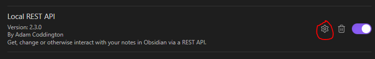
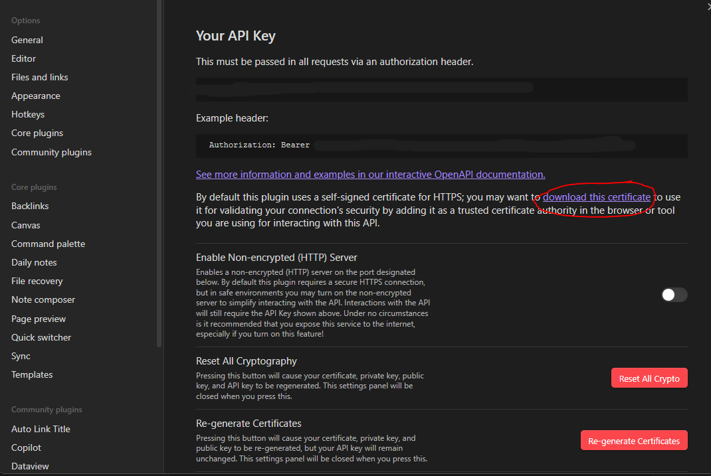
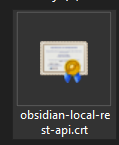
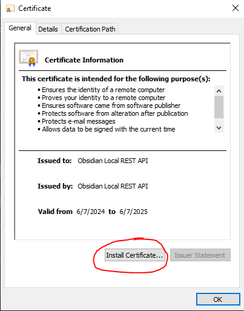
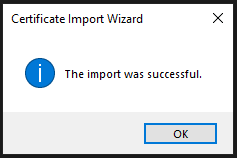

# Installing the Local Rest API Certificate

To use the Obsidial Local REST API plugin that obsidilicious depends on, you need to install a
cert from the plugin. To do this, first export the cert from Obsidian:

- Open Obsidian and navigate to the Local REST API plugin settings.
- Click on the link to download the certificate.
   
   

## Windows

1. **Install the Certificate**
   - Locate the downloaded certificate file and double-click on it to open the Certificate window.

   - 
   - You may get a Security Warning. Click "Open" anyway.
   - Click on the `Install Certificate` button.
   - 
   - Select `Current User`, click `Next`
   - Choose `Automatically select the certificate store based on the type of certificate`
     and click `Next` again.
   - Click `Finish` to complete the installation.
   - You should see a message stating that the import was successful.
   - 

## macOS

1. **Export the Certificate from Obsidian**
   - Open Obsidian and navigate to the Local REST API plugin settings.
   - Click on the option to download or export the certificate.

2. **Open Keychain Access**
   - Open `Finder` and go to `Applications` > `Utilities` > `Keychain Access`.

3. **Import the Certificate**
   - In Keychain Access, select `System` from the left sidebar.
   - Drag and drop the certificate file into the `System` keychain or go to `File` > `Import Items` and select the certificate file.
   - When prompted, enter your macOS password to authorize the changes.

4. **Set Trust Settings**
   - Find the imported certificate in the `System` keychain.
   - Double-click on the certificate to open its details.
   - Expand the `Trust` section.
   - Set `When using this certificate` to `Always Trust`.
   - Close the details window to save the changes.

## Linux (Browser Install)

1. **Export the Certificate from Obsidian**
   - Open Obsidian and navigate to the Local REST API plugin settings.
   - Click on the option to download or export the certificate.

2. **Open Browser Certificate Settings**
   - Open your browser (Chrome, Firefox, etc.).
   - Navigate to the settings or preferences menu.
   - Search for `certificates` or `security` settings.

3. **Import the Certificate in Chrome**
   - In Chrome, go to `Settings` > `Privacy and security` > `Security`.
   - Scroll down to `Manage certificates`.
   - In the `Certificates` window, go to the `Authorities` tab.
   - Click on `Import` and select the certificate file.
   - Follow the prompts to import the certificate and ensure it is added as a trusted authority.

4. **Import the Certificate in Firefox**
   - In Firefox, go to `Preferences` > `Privacy & Security`.
   - Scroll down to `Certificates` and click on `View Certificates`.
   - Go to the `Authorities` tab and click on `Import`.
   - Select the certificate file and choose to trust the certificate for website identification.

5. **Verify Installation**
   - Restart your browser to apply the changes.
   - Navigate to the API URL in your browser to verify that the certificate is trusted.