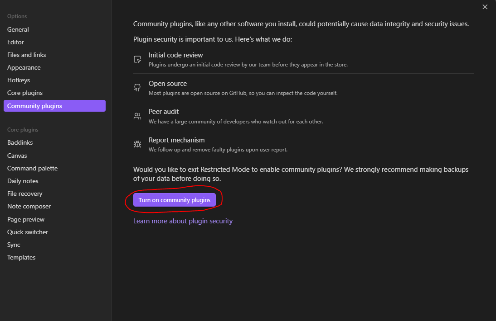
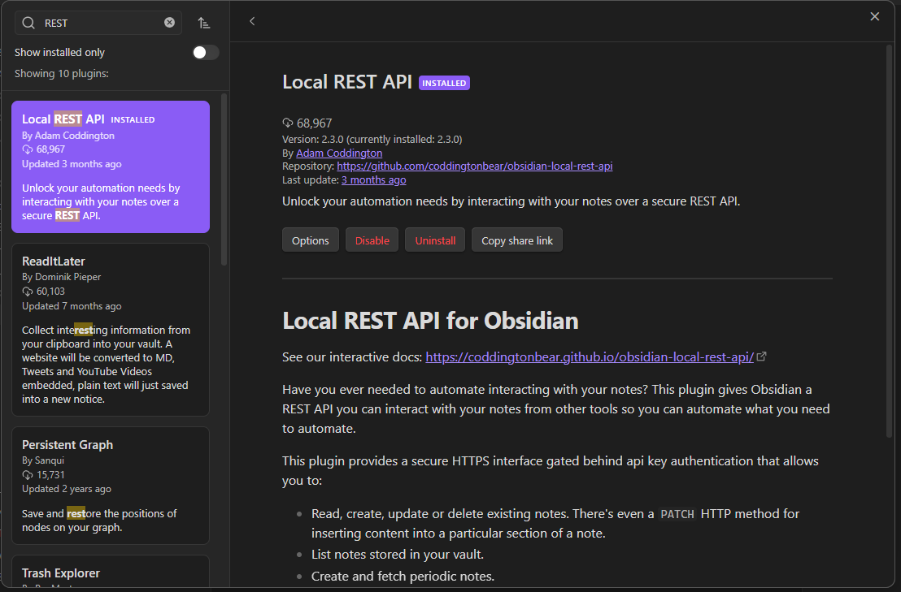
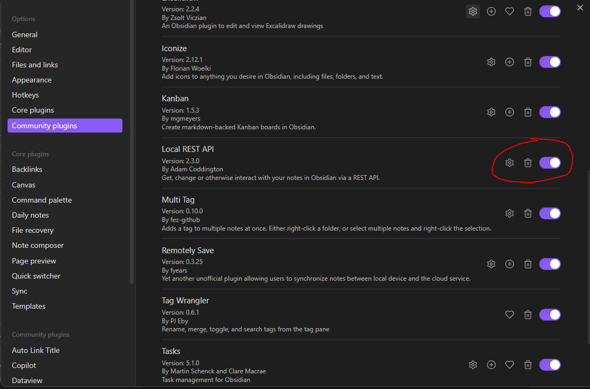
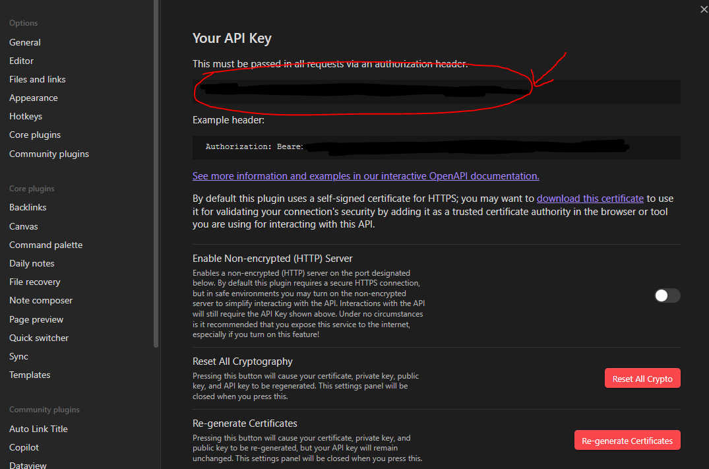
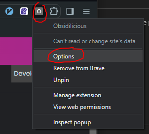
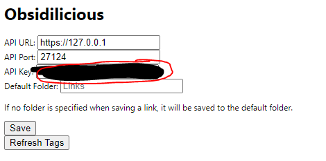
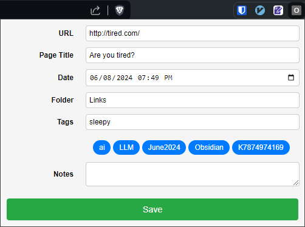

# Obsidilicious

Welcome to Obsidilicious, a Chrome extension that lets you save bookmarks
directly to your Obsidian vault. This tool combines the power of Obsidian's
note-taking capabilities with the convenience of a bookmarking tool.

## Prerequisites

- **Google Chrome**: Ensure you have the latest version of Chrome installed.
- **Obsidian**: Make sure you have Obsidian installed and set up on your computer.

## Setup

### Installing and Activating the Local REST API Community Plugin in Obsidian

1. **Enable Community Plugins**

   - Open Obsidian.
   - Go to `Settings` > `Community plugins`.
   - Toggle the switch to enable community plugins if it isn't already enabled.
  

2. **Install the Local REST API Community Plugin**

   - [Click here to install the Local REST API Plugin in Obsidian](obsidian://show-plugin?id=obsidian-local-rest-api)
   - Or, to install it manually:
     - In the Community plugins tab, click on `Browse`.
     - Search for `Local REST API`.
     - Click `Install`.
       

3. **Activate the Local REST API Plugin**

   - After installing, go back to the Community plugins tab.
   - Find `Local REST API` in the list and click `Enable`.
     

4. **Install the REST Local API Certificate on Your Browser/OS**

   - [See here for instructions on Windows, MacOS, and Linux](README-CERT-INSTALL.md)

5. **Copy the API Key**
   - Go to the Local REST API plugin settings in Obsidian.
   - Copy the API key provided.
     

### Adding the API Key to the Extension

1. **Open the Extension Options**

   - Click on the Obsidilicious icon in your Chrome toolbar.
   - Select `Options`.
     

2. **Enter the API Details**
   - In the options page, enter API Key you copied from Obsidian.
   - Optionally change the default folder where links will be saved (default: `Links/`)
   - Click `Save`.
   - 

## Usage

### Saving a Link

  - Click on the Obsidilicious icon in your Chrome toolbar.
  - The popup form will appear.
  - The URL and Page Title will be auto-filled.
  - Add or modify the Date, Folder, Tags, and Notes as needed.
  - Click `Save`.
  - 